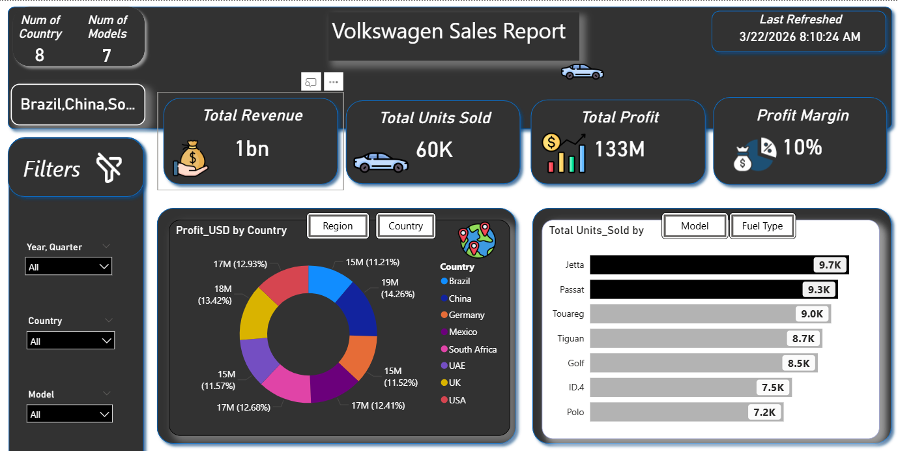
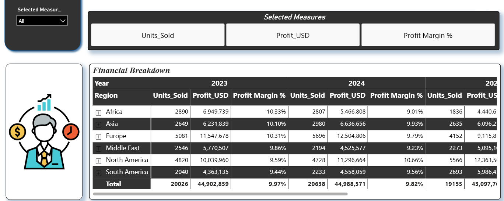
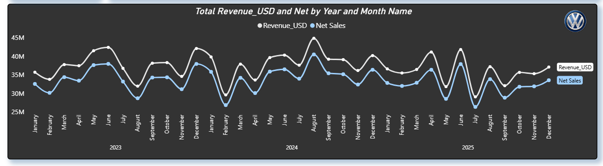
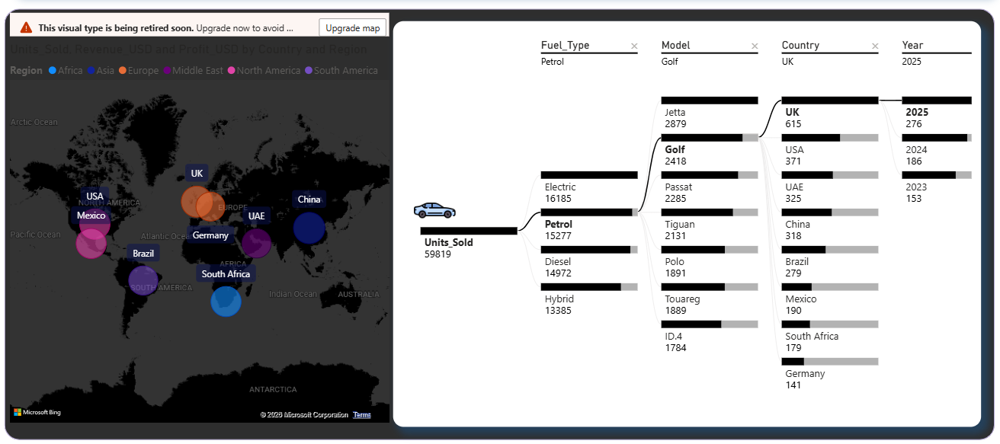

# 🚗 Volkswagen Sales Performance Dashboard

## 📊 Project Overview

The **Volkswagen Sales Performance Dashboard** is an advanced interactive Power BI solution that analyzes global sales performance across **time, region, country, product models, and customer segments**.

This project combines **time-series analysis, profitability tracking, and interactive storytelling (bookmarks & tooltips)** to deliver actionable business insights.

---

## 🎯 Key Objectives

* Track **Revenue and Net Sales trends (2023–2025)**
* Analyze **Profit (USD) and Profit Margins (~10%)**
* Compare **regional and country-level performance**
* Evaluate **model-level sales performance**
* Enhance analysis using **bookmarks and tooltips**

---
## 📷 Dashboard Screenshots

## 📁 Dataset Description

### 🔹 Sales & Profit Data

* Region & Country
* Model (Golf, Tiguan, Passat, ID.4, Polo, Touareg, Jetta)
* Units Sold
* Profit (USD) → **Total: ~132.99M USD (overall snapshot)**
* Profit Margin → **~9.9% average**

### 🔹 Time-Series Data (2023–2025)

* Monthly Revenue & Net Sales

#### 📅 Sample Metrics:

* **Highest Revenue:**

  * August 2024 → **44.86M USD**

* **Lowest Revenue:**

  * July 2025 → **29.05M USD**

* **Strong Months:**

  * June 2023 → **42.40M USD**
  * December 2023 → **42.10M USD**

* **Net Sales Example:**

  * January 2024 → **35.80M USD**
  * August 2024 → **40.50M USD**

---

## 📊 Dashboard Features

### 🍩 Donut Chart (Dynamic View)

Interactive donut chart using bookmarks:

* **Profit (USD) by Region**
* **Profit (USD) by Country**

✔ Enables switching between **high-level and detailed insights**

---

### 🔖 Bookmarks Functionality

* 🔄 **Region vs Country Toggle**
* 🚘 **Units Sold by Model View**
* 📊 **Full Reset View**

---

### 🧠 Advanced Tooltip Pages

#### 📌 Tooltip 1: Units Sold Breakdown

* Units Sold by Model
* Units Sold by Customer Segment

#### 📌 Tooltip 2: Model Analysis

* Focused breakdown of **Units Sold by Model**

---

## 📈 Key Insights

### 💰 Revenue & Sales Trends

* Revenue is **stable between 30M – 45M USD monthly**
* Clear **seasonality pattern**:

  * Peaks → Mid-year & year-end
  * Dips → Early year & mid-year (e.g., Feb 2024, Jul 2025)

---

### 🌍 Regional Performance

* **Top Regions by Profit:**

  * Europe → **~33.17M USD**
  * North America → **~33.70M USD**
* **Mid-tier:**

  * Asia → **~18.96M USD**
* **Growth Markets:**

  * Africa → **~16.85M USD**
  * South America → **~14.90M USD**

---

### 🚘 Model Performance Insights

* **Top Models by Units Sold:**

  * Tiguan
  * Golf
  * Passat

* Example (South Africa):

  * Tiguan → **1,284 units**
  * Passat → **1,162 units**
  * Golf → **933 units**

---

### 📊 Profitability Insights

* Profit margins are **consistent (~9%–11%)**
* Higher margins observed in:

  * ID.4 (selected markets)
  * Premium segments like Touareg

---

### 👥 Customer Insights

* Customer segmentation shows **variation in purchasing behavior**
* Tooltips highlight:

  * Contribution of each segment
  * Model preference by segment

---

## 🛠️ Tools & Technologies

* **Power BI** – Visualization & interactivity
* **Excel / CSV** – Data processing
* **GitHub** – Project hosting

---

## 📷 Dashboard Highlights

* KPI Cards (Revenue, Net Sales, Profit)
* Time-Series Line Charts (2023–2025)
* 🍩 Donut Chart with Bookmark Toggle
* Model Performance Charts
* Interactive Filters (Region, Model, Year)
* 🧠 Custom Tooltip Pages

---

## 🚀 How to Use

1. Clone or download this repository
2. Open `.pbix` file in Power BI Desktop
3. Use:

   * Bookmarks to switch views
   * Tooltips for detailed insights
   * Filters for deep analysis

---

## 🤝 Contributing

Contributions are welcome! Feel free to fork and submit pull requests.

---

## 📬 Contact

Available for **Data Analyst / BI roles and collaborations**

---

⭐ **If you like this project, give it a star on GitHub!**
